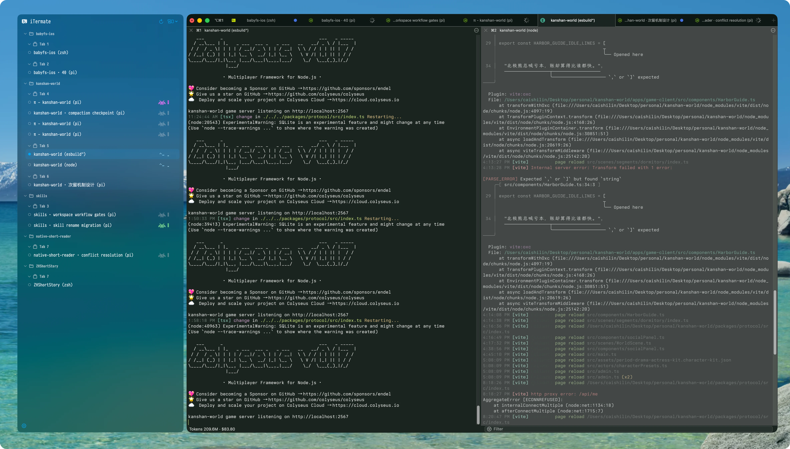

<div align="center">

# iTermate

**面向 iTerm2 与 Ghostty Session 的原生 macOS 伴随面板。**

无需离开终端，即可随时掌握 Window、Tab、项目、Shell 命令及编程 Agent 的活动状态。

[English](README.md) · [简体中文](README.zh-CN.md)

</div>

<p align="center">
  <a href="https://github.com/SSBun/iTermate/releases/latest"></a>
  
  
  
</p>

<p align="center">
  
</p>

## 概览

iTermate 会在当前前台 iTerm2 或 Ghostty 窗口旁显示轻量、可调整尺寸的浮动面板。它能呈现终端的 Window → Tab → Session 层级，也能按项目目录重新分组，并显示 Shell 与受支持编程 Agent 的运行、完成、失败或等待输入状态。

iTerm2 由随 App 分发的 Python Bridge 通过官方 API 读取，Ghostty 则使用官方 AppleScript 接口；Session 导航与状态更新都在本机完成。

## 主要功能

- **始终紧随当前工作区**——跟随前台 iTerm2 或 Ghostty 窗口，并在两者均不处于前台时自动隐藏。
- **灵活组织 Session**——可按 Window 或 Project Path 分组，并显示可折叠的 Tab 子分组。
- **直接操作 Session**——聚焦或关闭单个 Session、关闭整个分组，并可从面板两侧调整宽度。
- **自定义项目分组**——固定、收藏项目目录并为其设置颜色。
- **实时活动状态**——区分普通 Shell 命令与编程 Agent 工作，并显示运行或完成时间。
- **可配置状态视觉**——可为每种状态选择 Alien、Robot 或 Classic 动画及独立颜色。
- **原生 macOS 能力**——支持登录时启动、完成通知、菜单栏控制、外观设置与 Sparkle 更新。
- **编程 Agent 集成**——可选接入 [Pi](https://github.com/badlogic/pi-mono) 与 [Codex](https://github.com/openai/codex) 生命周期状态。
- **无需辅助功能权限**——iTermate 无需通过 macOS 辅助功能 API 控制系统即可跟随 iTerm2。

## 运行要求

- macOS 13 Ventura 或更高版本
- 下载版需要 Apple Silicon Mac（`arm64`）
- 已安装 [iTerm2](https://iterm2.com/) 或 [Ghostty](https://ghostty.org/)

> Ghostty 活动状态图标要求其 AppleScript Terminal 暴露 `tty`；Ghostty 1.3.1 尚不具备该属性。

## 安装

1. 从 [GitHub Releases](https://github.com/SSBun/iTermate/releases/latest) 下载最新 DMG。
2. 打开 DMG，将 **iTermate** 拖入 **Applications**。
3. 先启动 iTerm2 或 Ghostty，再打开 iTermate。
4. macOS 提示 iTermate 与终端通信时，允许自动化权限。

> [!IMPORTANT]
> 当前公开构建使用 ad hoc 签名，且**未经过 Apple 公证**。请先核对发布页提供的 `.sha256` 文件；若 macOS 阻止首次启动，请按住 Control 点击 **iTermate.app** 并选择**打开**。

使用 iTerm2 时，iTermate 会自动将随 App 分发的 Bridge 安装到 iTerm2 AutoLaunch 脚本目录并管理其生命周期，无需单独配置 Python。

## 使用方法

### 浏览与操作 Session

- 通过面板菜单在 **Window** 与 **Project Path** 分组之间切换。
- 点击 Session，在 iTerm2 中激活对应 Tab 与 pane。
- 将指针悬停在 Session 上可显示关闭按钮。
- 展开或折叠 Window、Tab 与 Project Path 分组。
- 通过 Project Path 上下文菜单固定、收藏项目，或设置自定义颜色。

### 配置 iTermate

点击面板中的齿轮按钮或 iTermate 菜单栏项目，可配置：

- 分别控制面板是否在 iTerm2 与 Ghostty 中显示；
- 优先停靠在 iTerm2 左侧或右侧；
- 系统、浅色或深色外观，以及模糊或不透明背景；
- 强调色、字体与字号；
- Tab 标题、项目标题样式、Session 时间及其格式；
- 完成通知与登录时启动；
- 每种状态的动画样式和颜色。

### 启用编程 Agent 状态

打开 **Settings → Agents**，启用所使用的集成：

- **Pi：**启用 Pi，然后在现有 Pi Session 中执行 `/reload`。
- **Codex：**启用 Codex，然后通过 `/hooks` 检查并批准新增 Hook。

目前仅 Pi 与 Codex 支持 Agent 集成。在 Ghostty 中如需普通命令状态，请在同一设置页启用对应的 zsh、Bash 或 fish 开关并重启该 Shell；iTerm2 仍由 Bridge 观察普通 Shell 活动。

## 故障排查

- **显示“Waiting for iTerm2 Bridge”**——确认 iTerm2 正在运行，在**系统设置 → 隐私与安全性 → 自动化**中允许 iTermate；必要时重启 iTerm2。
- **活动状态未及时更新**——点击面板标题栏的刷新按钮；它只重启 Bridge，不会重启 iTerm2 或其中的 Session。
- **未显示 Agent 状态**——确认已在 **Settings → Agents** 中启用集成，并按上文说明重新加载或批准集成。

## 从源码构建

仓库已包含 Xcode 工程，并通过 Swift Package Manager 解析 [Sparkle 2](https://github.com/sparkle-project/Sparkle)。

```bash
git clone https://github.com/SSBun/iTermate.git
cd iTermate
open iTermate.xcodeproj
```

在 Xcode 中选择 **iTermate** Scheme 并运行，或通过命令行构建：

```bash
xcodebuild -project iTermate.xcodeproj \
  -scheme iTermate \
  -configuration Debug \
  build
```

[`project.yml`](project.yml) 是项目设置的规范来源。修改后请使用 [XcodeGen](https://github.com/yonaskolb/XcodeGen) 重新生成 Xcode 工程：

```bash
xcodegen generate
```

## 项目结构

| 路径 | 职责 |
| --- | --- |
| [`iTermate/`](iTermate/) | 原生 SwiftUI/AppKit App、浮动面板、设置、通知与 Bridge 客户端 |
| [`iTermateBridge/`](iTermateBridge/) | 通过 iTerm2 官方 API 读取并操作 iTerm2 的 Python helper |
| [`integrations/`](integrations/) | 可选的 Pi 与 Codex 生命周期适配器 |
| [`iTermateTests/`](iTermateTests/) | 覆盖分组、Bridge 消息、集成、布局与通知的测试 |
| [`docs/appcast.xml`](docs/appcast.xml) | Sparkle 更新 feed |
| [`project.yml`](project.yml) | XcodeGen 项目配置的规范来源 |

## 更新与发布

iTermate 通过 Sparkle 检查更新。也可选择 **Settings → About → Check for Updates…**，或直接访问 [GitHub Releases](https://github.com/SSBun/iTermate/releases)。

版本说明请参阅 [`CHANGELOG.md`](CHANGELOG.md)。
